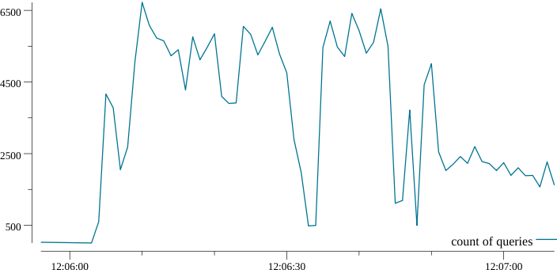

# tsplt

plot time series data

## Usage

``` console
$ cat ts.tsv | tsplt -o ts.png
```

``` console
$ tsplt -i ts.tsv -o ts.png
```

## Input time series data

Default delimiter : `\t`

| timestamp | d1 | d2 | ... |
| --- | --- | --- | --- | 
| `[timestamp]` | number | number | ... |
| `[timestamp]` | number | number | ... |
| `[timestamp]` | number | number | ... |
| ... | ... | ... | ... |

### Timestamp format

tsplt parse `[timestamp]` using [araddon/dateparse](https://github.com/araddon/dateparse).

## Output plot image

Output plot image of [sample time series tsv](testdata/isucon.tsv).



## Install

**homebrew tap:**

```console
$ brew install k1LoW/tap/tsplt
```

**manually:**

Download binany from [releases page](https://github.com/k1LoW/tsplt/releases)

**go get:**

```console
$ go get github.com/k1LoW/tsplt
```
